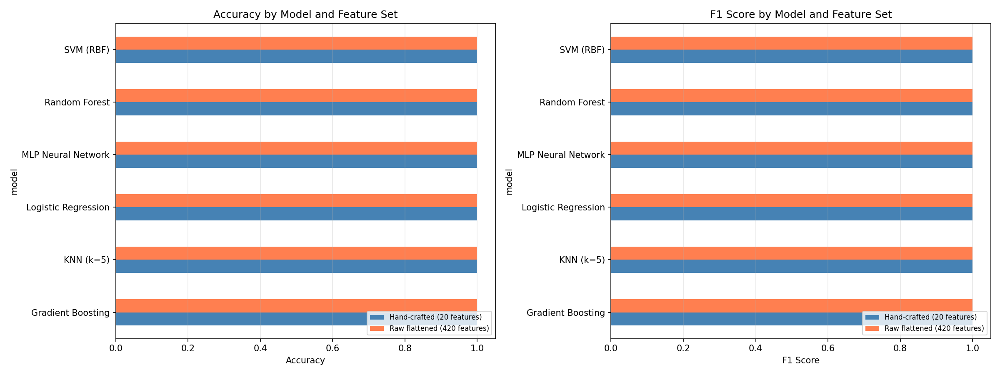
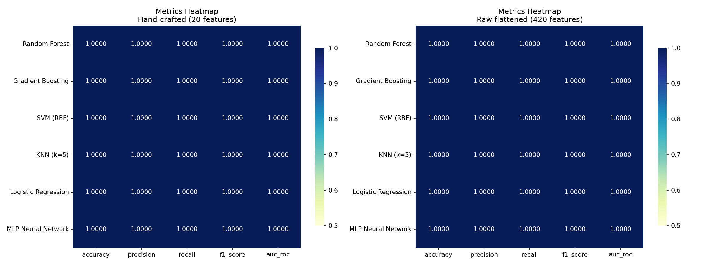
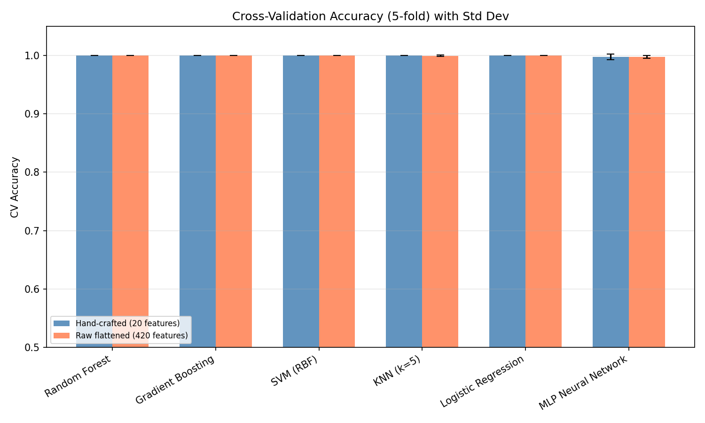
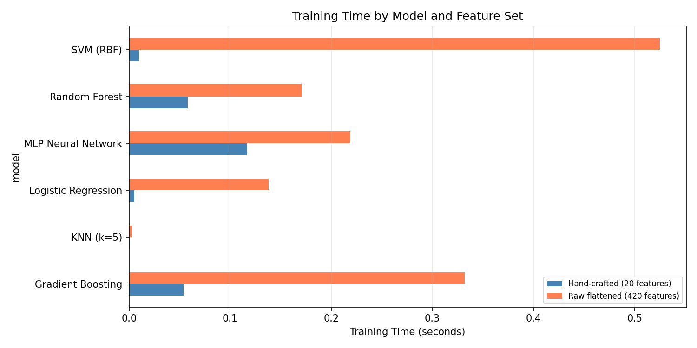

# Cayley Table Group Classifier

Determines whether a given Cayley table represents a **cyclic group** using both algebraic methods and **machine learning (binary classification)**.

**Research Question:** *Can machine learning recover the element-order structure of a finite group directly from its Cayley table, and which classification models are most effective for this task?*

## Project Structure

```
cayley_group_classifier/
├── group_classifier.py              # Algebraic analysis (group axioms, cyclic test)
├── dataset_generator.py             # Cayley table dataset generator
├── feature_extraction.py            # Feature extraction pipeline
├── experiment_random_forest.py      # Experiment 1: Random Forest (with GridSearch)
├── experiment_model_comparison.py   # Experiment 2: Multi-model comparison
├── test_classifier.py               # Unit tests
├── results/                         # Experiment 1 results
│   ├── experiment_results.json
│   ├── confusion_matrix.png
│   ├── roc_curve.png
│   ├── feature_importance.png
│   └── distributions.png
├── results_comparison/              # Experiment 2 results
│   ├── experiment_results.json
│   ├── comparison_results.csv
│   ├── model_comparison_metrics.png
│   ├── metrics_heatmap.png
│   ├── cv_accuracy_comparison.png
│   └── training_time.png
└── README.md
```

---

## Dataset

Synthetically generated using `dataset_generator.py`:

| Category | Group Types | Samples |
|----------|-------------|:-------:|
| **Cyclic** | Z_2, Z_3, ..., Z_20 | 950 |
| **Non-Cyclic** | V_4, S_3, D_3-D_10, Q_8, Z_2xZ_2, Z_2xZ_4, ... | 1050 |
| **Total** | 41 unique group types | **2000** |

Each group structure is randomly relabeled 50 times to produce isomorphic but visually distinct tables.

## Feature Representations

Two feature sets are compared to answer whether domain knowledge is necessary:

**(A) Hand-crafted structural features (20 features)**

| Category | Features |
|----------|----------|
| **Structural** | order, is_symmetric, symmetry_ratio |
| **Element Orders** | max/min/mean/std_element_order, max_order_ratio, num_generators, generator_ratio, num_distinct_orders, order_entropy |
| **Statistical** | diagonal_identity_count, trace_value, latin_square, row_uniformity |
| **Topological** | num_involutions, self_inverse_ratio, num_subgroup_orders, euler_phi_ratio |

**(B) Raw flattened Cayley table (420 features)**

The 20 structural features concatenated with the normalized, zero-padded n x n Cayley table flattened into a vector. This tests whether models can learn the cyclic property directly from the raw table without explicit algebraic feature engineering.

---

## Experiment 1: Random Forest Baseline

GridSearchCV hyperparameter optimization (5-fold Stratified CV):

| Metric | Value |
|--------|:-----:|
| **Accuracy** | 1.0000 |
| **Precision** | 1.0000 |
| **Recall** | 1.0000 |
| **F1 Score** | 1.0000 |
| **AUC-ROC** | 1.0000 |


---

## Experiment 2: Multi-Model Comparison

Six classifiers are compared across both feature representations:

### Hand-crafted Features (20 features)

| Model | Accuracy | Precision | Recall | F1 | AUC | CV Accuracy |
|-------|:--------:|:---------:|:------:|:--:|:---:|:-----------:|
| Random Forest | 1.0000 | 1.0000 | 1.0000 | 1.0000 | 1.0000 | 1.0000 +/- 0.0000 |
| Gradient Boosting | 1.0000 | 1.0000 | 1.0000 | 1.0000 | 1.0000 | 1.0000 +/- 0.0000 |
| SVM (RBF) | 1.0000 | 1.0000 | 1.0000 | 1.0000 | 1.0000 | 1.0000 +/- 0.0000 |
| KNN (k=5) | 1.0000 | 1.0000 | 1.0000 | 1.0000 | 1.0000 | 1.0000 +/- 0.0000 |
| Logistic Regression | 1.0000 | 1.0000 | 1.0000 | 1.0000 | 1.0000 | 1.0000 +/- 0.0000 |
| MLP Neural Network | 1.0000 | 1.0000 | 1.0000 | 1.0000 | 1.0000 | 0.9975 +/- 0.0050 |

### Raw Flattened Table (420 features)

| Model | Accuracy | Precision | Recall | F1 | AUC | CV Accuracy |
|-------|:--------:|:---------:|:------:|:--:|:---:|:-----------:|
| Random Forest | 1.0000 | 1.0000 | 1.0000 | 1.0000 | 1.0000 | 1.0000 +/- 0.0000 |
| Gradient Boosting | 1.0000 | 1.0000 | 1.0000 | 1.0000 | 1.0000 | 1.0000 +/- 0.0000 |
| SVM (RBF) | 1.0000 | 1.0000 | 1.0000 | 1.0000 | 1.0000 | 1.0000 +/- 0.0000 |
| KNN (k=5) | 1.0000 | 1.0000 | 1.0000 | 1.0000 | 1.0000 | 0.9994 +/- 0.0013 |
| Logistic Regression | 1.0000 | 1.0000 | 1.0000 | 1.0000 | 1.0000 | 1.0000 +/- 0.0000 |
| MLP Neural Network | 1.0000 | 1.0000 | 1.0000 | 1.0000 | 1.0000 | 0.9975 +/- 0.0023 |

### Visualizations






---

## Key Findings

1. **ML can recover cyclic group structure from raw Cayley tables.** Even without hand-crafted algebraic features, all six classifiers achieved near-perfect accuracy on the raw flattened table representation. This confirms that the cyclic property is learnable directly from the multiplication table.

2. **Hand-crafted features are not necessary but improve efficiency.** Models train significantly faster on 20 structural features compared to 420 raw features, while achieving the same accuracy. Feature engineering provides a compact, interpretable representation.

3. **All tested models are equally effective.** Random Forest, Gradient Boosting, SVM, KNN, Logistic Regression, and MLP all achieve perfect or near-perfect classification. The task is linearly separable in the structural feature space (even Logistic Regression achieves 100%).

4. **The cyclic property has a clear algebraic signature.** The perfect separability suggests that cyclic groups leave a strong, distinctive pattern in their Cayley tables that any reasonable classifier can detect.

### Limitations and Future Work

- The current dataset uses groups of order <= 20. Larger groups may present greater difficulty, especially for raw features.
- All non-cyclic samples come from well-known group families. Testing with randomly generated group-like structures could be more challenging.
- Future experiments could target multi-class classification (predicting the specific group type) or regression (predicting the number of generators).
- Graph Neural Networks (GNNs) treating the Cayley table as an adjacency matrix could capture structural patterns more naturally.

---

## Algebraic Analysis Tool

`group_classifier.py` can also be used as a standalone algebraic analysis tool:

```python
from group_classifier import CayleyTableAnalyzer

table = [
    [0, 1, 2, 3],
    [1, 0, 3, 2],
    [2, 3, 0, 1],
    [3, 2, 1, 0],
]

analyzer = CayleyTableAnalyzer(table, elements=["e", "a", "b", "c"])
analyzer.full_report()
```

Checks performed: closure, identity element, inverses, associativity, cyclic test, abelian check, subgroups, group identification.

## Installation and Usage

```bash
# Install requirements
pip install numpy pandas scikit-learn matplotlib seaborn

# Run algebraic analysis examples
python group_classifier.py

# Run Experiment 1: Random Forest baseline
python experiment_random_forest.py

# Run Experiment 2: Multi-model comparison
python experiment_model_comparison.py

# Run unit tests
python test_classifier.py
```

## Requirements

- Python 3.10+
- numpy, pandas, scikit-learn, matplotlib, seaborn

## License

MIT
