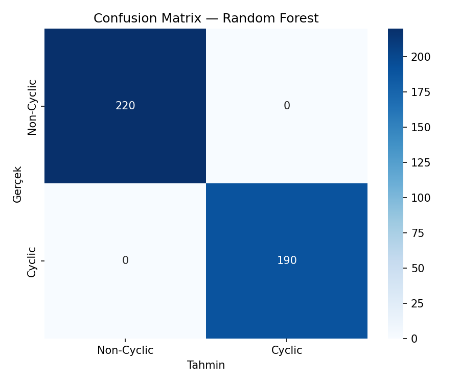
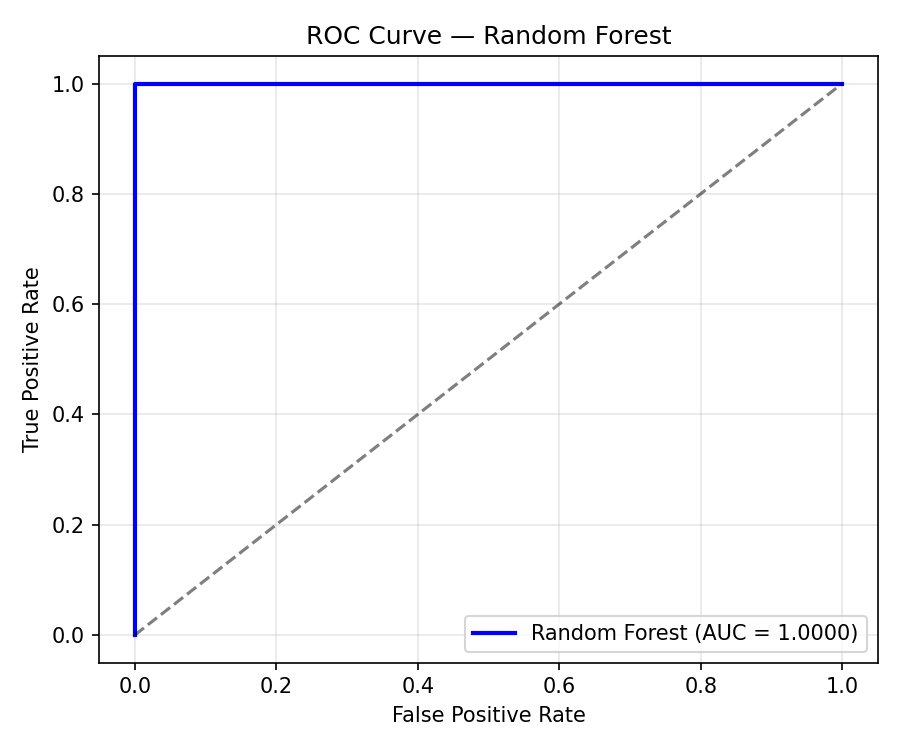
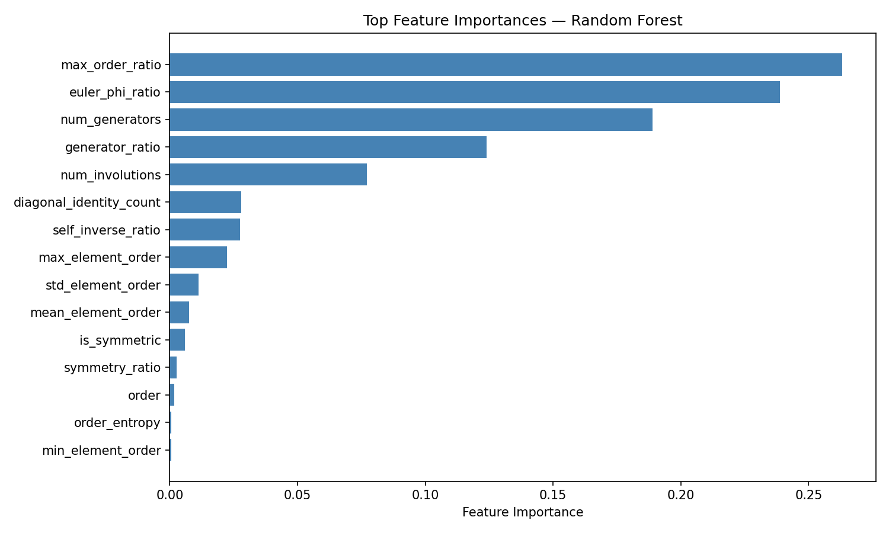
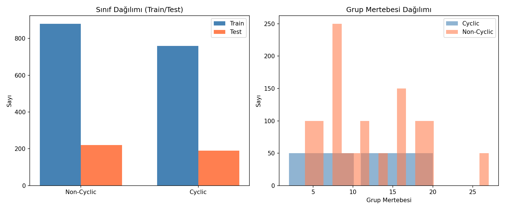

# Cayley Table Group Classifier

Verilen bir Cayley tablosunun **cyclic olup olmadığını** hem cebirsel yöntemlerle hem de **makine öğrenmesi (binary classification)** ile belirleyen bir Python projesi.

## Proje Yapısı

```
cayley_group_classifier/
├── group_classifier.py          # Cebirsel analiz (grup aksiyomları, cyclic testi)
├── dataset_generator.py         # Cayley table veri seti üreteci
├── feature_extraction.py        # Öznitelik çıkarma pipeline'ı
├── experiment_random_forest.py  # Random Forest deneyi
├── test_classifier.py           # Birim testler
├── results/                     # Deney sonuçları
│   ├── experiment_results.json  # Tüm metrikler (JSON)
│   ├── dataset.csv              # Üretilen veri seti
│   ├── confusion_matrix.png     # Confusion matrix görseli
│   ├── roc_curve.png            # ROC eğrisi
│   ├── feature_importance.png   # Öznitelik önem sıralaması
│   └── distributions.png        # Sınıf ve mertebe dağılımları
└── README.md
```

---

## Deney: Binary Classification ile Cyclic Grup Tespiti

### Amaç

Bir Cayley tablosunun temsil ettiği grubun **cyclic olup olmadığını** makine öğrenmesi ile sınıflandırmak.

### Veri Seti

Veri seti `dataset_generator.py` ile sentetik olarak üretilmiştir:

| Kategori | Grup Tipleri | Örnek Sayısı |
|----------|-------------|:------------:|
| **Cyclic** | Z₂, Z₃, ..., Z₂₀ | 950 |
| **Non-Cyclic** | V₄, S₃, D₃–D₁₀, Q₈, Z₂×Z₂, Z₂×Z₄, ... | 1100 |
| **Toplam** | 41 benzersiz grup tipi | **2050** |

Her grup yapısından 50 farklı **rastgele yeniden etiketleme (relabeling)** ile izomorfik ama farklı görünen tablolar üretilmiştir.

### Öznitelikler (Features)

Cayley tablolarından 20 yapısal öznitelik çıkarılmıştır:

| Kategori | Öznitelikler |
|----------|-------------|
| **Yapısal** | order, is_symmetric, symmetry_ratio |
| **Eleman Mertebeleri** | max/min/mean/std_element_order, max_order_ratio, num_generators, generator_ratio, num_distinct_orders, order_entropy |
| **İstatistiksel** | diagonal_identity_count, trace_value, latin_square, row_uniformity |
| **Topolojik** | num_involutions, self_inverse_ratio, num_subgroup_orders, euler_phi_ratio |

### Model: Random Forest

GridSearchCV ile hiperparametre optimizasyonu yapılmıştır (5-fold Stratified CV):

| Parametre | Değer |
|-----------|:-----:|
| n_estimators | 50 |
| max_depth | 5 |
| min_samples_split | 2 |
| min_samples_leaf | 1 |

### Sonuçlar

| Metrik | Değer |
|--------|:-----:|
| **Accuracy** | 1.0000 |
| **Precision** | 1.0000 |
| **Recall** | 1.0000 |
| **F1 Score** | 1.0000 |
| **AUC-ROC** | 1.0000 |

#### Confusion Matrix



#### ROC Curve



#### Feature Importance



#### Sınıf Dağılımı



### Tartışma

Model %100 doğruluk elde etmiştir. Bu sonuç, çıkarılan özniteliklerin (özellikle `max_order_ratio` ve `euler_phi_ratio`) cyclic grup yapısını doğrudan yansıtmasından kaynaklanmaktadır. Cyclic bir grupta tanım gereği mertebesi *n* olan en az bir eleman bulunur, bu da `max_order_ratio = 1.0` olmasını garanti eder.

Bu durum, el ile tasarlanmış (hand-crafted) özniteliklerin güçlü bilgi taşıdığını göstermektedir. İleriki deneylerde:
- Sadece ham tablo verisi (flattened table) üzerinden sınıflandırma denenebilir
- Daha zorlu öznitelik alt kümeleri ile deney tekrarlanabilir
- Deep learning modelleri (CNN, GNN) ile yapısal öğrenme test edilebilir

---

## Cebirsel Analiz Aracı

`group_classifier.py` ayrıca bağımsız bir cebirsel analiz aracı olarak kullanılabilir:

```python
from group_classifier import CayleyTableAnalyzer

table = [
    [0, 1, 2, 3],
    [1, 0, 3, 2],
    [2, 3, 0, 1],
    [3, 2, 1, 0],
]

analyzer = CayleyTableAnalyzer(table, elements=["e", "a", "b", "c"])
analyzer.full_report()
```

Kontrol edilen özellikler: kapalılık, birim eleman, tersler, birleşme, cyclic testi, abelyen kontrolü, alt gruplar, grup tanımlama.

## Kurulum ve Çalıştırma

```bash
# Gereksinimler
pip install numpy pandas scikit-learn matplotlib seaborn

# Cebirsel analiz örnekleri
python group_classifier.py

# ML deneyini çalıştır
python experiment_random_forest.py

# Testler
python test_classifier.py
```

## Gereksinimler

- Python 3.10+
- numpy, pandas, scikit-learn, matplotlib, seaborn

## Lisans

MIT
